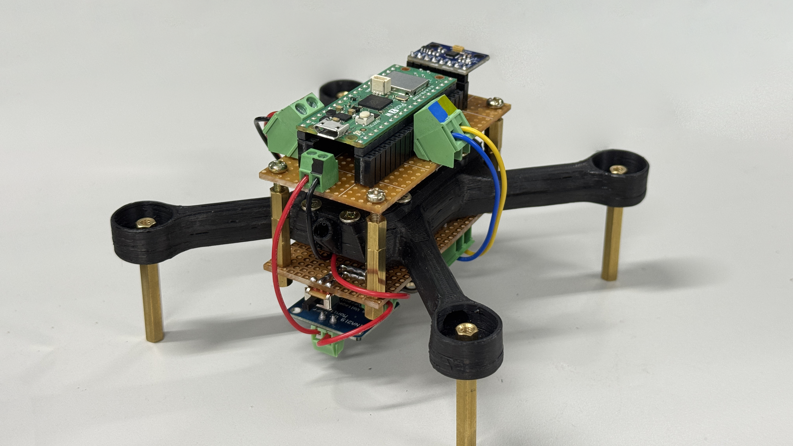
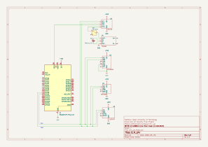
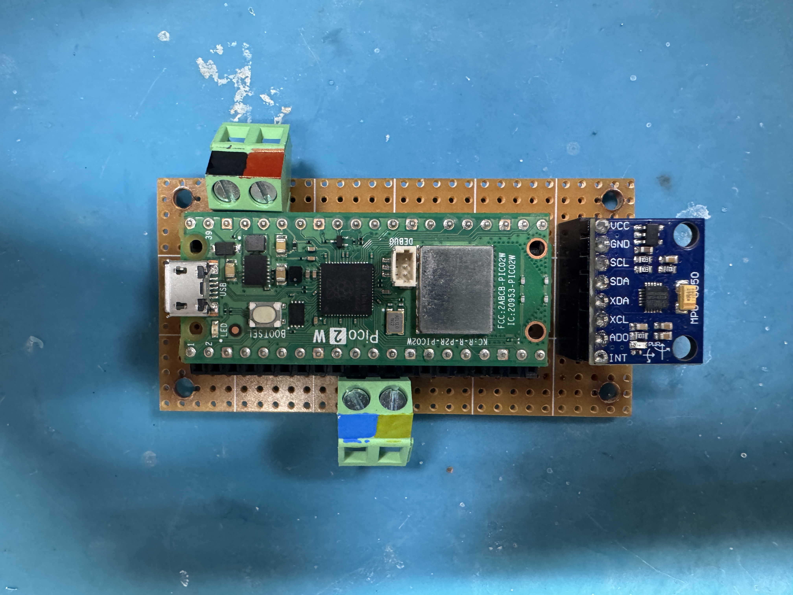
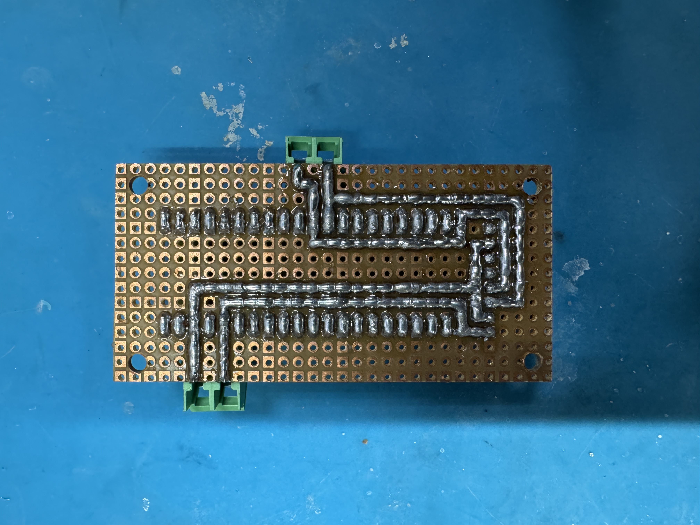
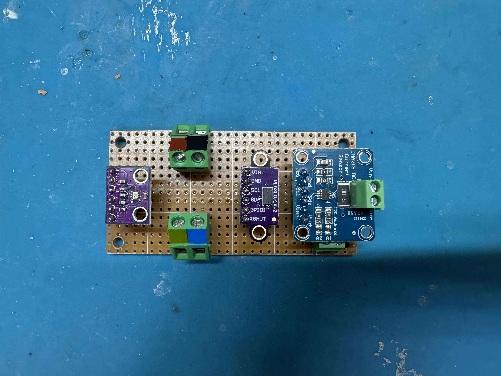
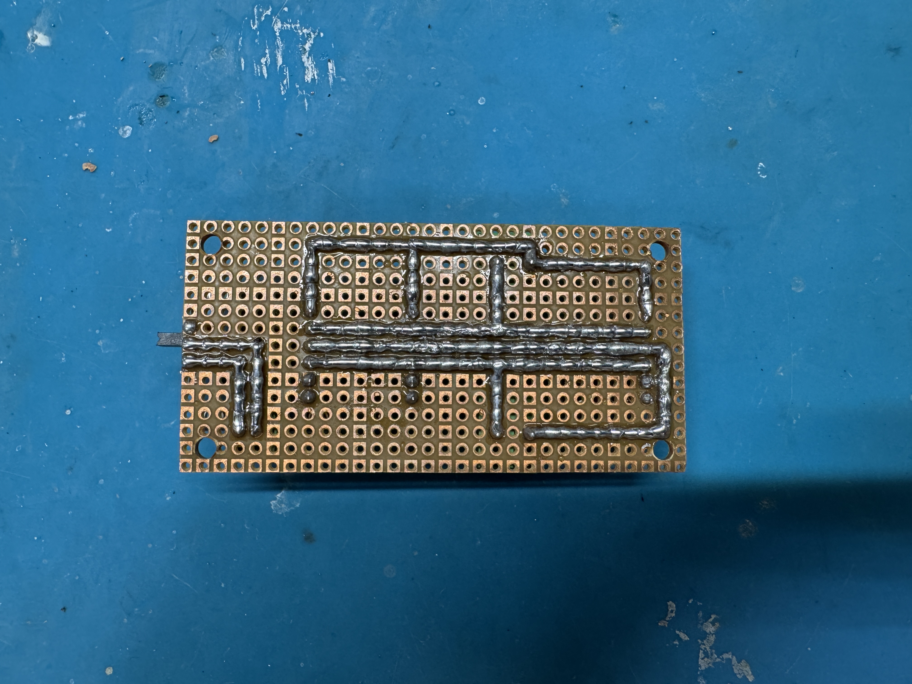
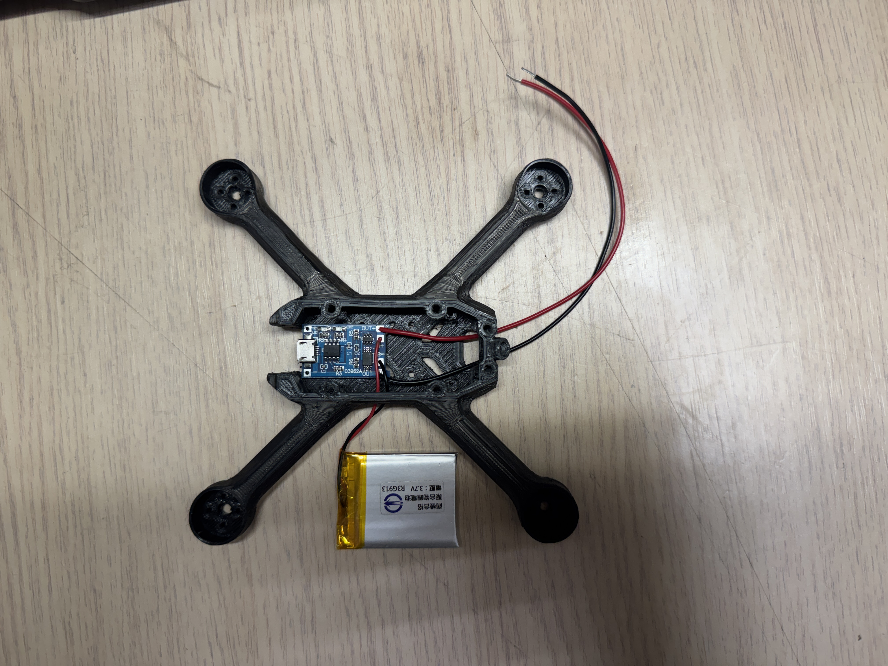
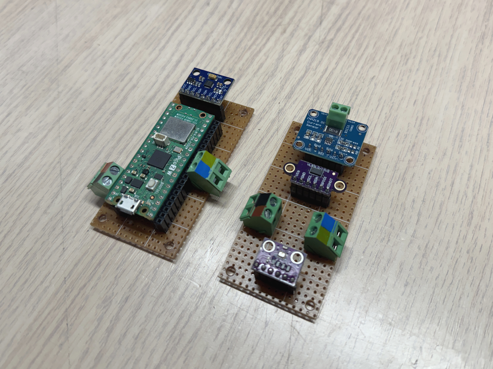
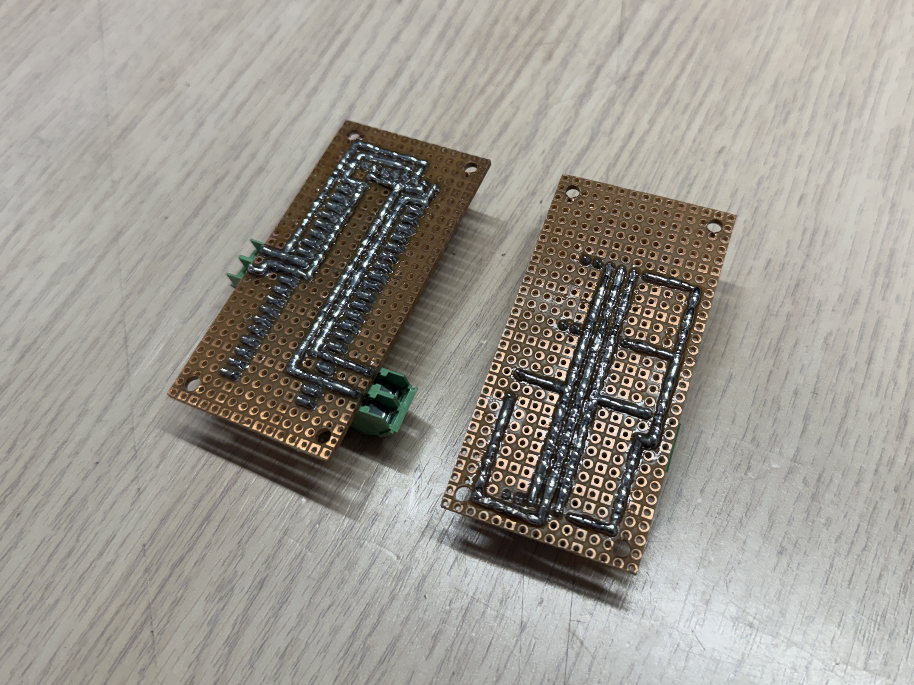
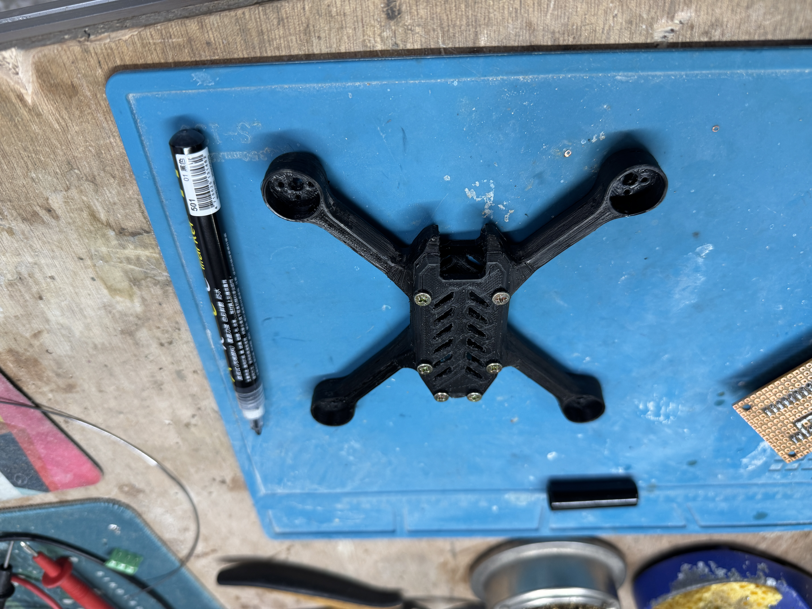

# CLM-UAV

[![Electronics](https://img.shields.io/badge/Electronics-B03931?style=flat&logo=data:image/svg+xml;base64,PCFET0NUWVBFIHN2ZyBQVUJMSUMgIi0vL1czQy8vRFREIFNWRyAxLjEvL0VOIiAiaHR0cDovL3d3dy53My5vcmcvR3JhcGhpY3MvU1ZHLzEuMS9EVEQvc3ZnMTEuZHRkIj4KDTwhLS0gVXBsb2FkZWQgdG86IFNWRyBSZXBvLCB3d3cuc3ZncmVwby5jb20sIFRyYW5zZm9ybWVkIGJ5OiBTVkcgUmVwbyBNaXhlciBUb29scyAtLT4KPHN2ZyB3aWR0aD0iODAwcHgiIGhlaWdodD0iODAwcHgiIHZpZXdCb3g9IjAgMCAyNCAyNCIgaWQ9IkxheWVyXzEiIGRhdGEtbmFtZT0iTGF5ZXIgMSIgeG1sbnM9Imh0dHA6Ly93d3cudzMub3JnLzIwMDAvc3ZnIiBmaWxsPSIjMDAwMEZGRkZGRiIgc3Ryb2tlPSIjMDAwMEZGRkZGRiI+Cg08ZyBpZD0iU1ZHUmVwb19iZ0NhcnJpZXIiIHN0cm9rZS13aWR0aD0iMCIvPgoNPGcgaWQ9IlNWR1JlcG9fdHJhY2VyQ2FycmllciIgc3Ryb2tlLWxpbmVjYXA9InJvdW5kIiBzdHJva2UtbGluZWpvaW49InJvdW5kIi8+Cg08ZyBpZD0iU1ZHUmVwb19pY29uQ2FycmllciI+Cg08ZGVmcz4KDTxzdHlsZT4uY2xzLTF7ZmlsbDpub25lO3N0cm9rZTojZmZmZmZmO3N0cm9rZS1taXRlcmxpbWl0OjEwO3N0cm9rZS13aWR0aDoxLjkycHg7fS5jbHMtMntmaWxsOiNmZmZmZmY7fTwvc3R5bGU+Cg08L2RlZnM+Cg08cmVjdCBjbGFzcz0iY2xzLTEiIHg9IjUuMjkiIHk9IjUuMjkiIHdpZHRoPSIxMy40MiIgaGVpZ2h0PSIxMy40MiIgcng9IjIuMjQiLz4KDTxsaW5lIGNsYXNzPSJjbHMtMSIgeDE9IjcuMjEiIHkxPSIwLjUiIHgyPSI3LjIxIiB5Mj0iNS4yOSIvPgoNPGxpbmUgY2xhc3M9ImNscy0xIiB4MT0iMTIiIHkxPSIwLjUiIHgyPSIxMiIgeTI9IjUuMjkiLz4KDTxsaW5lIGNsYXNzPSJjbHMtMSIgeDE9IjE2Ljc5IiB5MT0iMC41IiB4Mj0iMTYuNzkiIHkyPSI1LjI5Ii8+Cg08bGluZSBjbGFzcz0iY2xzLTEiIHgxPSI3LjIxIiB5MT0iMTguNzEiIHgyPSI3LjIxIiB5Mj0iMjMuNSIvPgoNPGxpbmUgY2xhc3M9ImNscy0xIiB4MT0iMTIiIHkxPSIxOC43MSIgeDI9IjEyIiB5Mj0iMjMuNSIvPgoNPGxpbmUgY2xhc3M9ImNscy0xIiB4MT0iMTYuNzkiIHkxPSIxOC43MSIgeDI9IjE2Ljc5IiB5Mj0iMjMuNSIvPgoNPGxpbmUgY2xhc3M9ImNscy0xIiB4MT0iMC41IiB5MT0iMTYuNzkiIHgyPSI1LjI5IiB5Mj0iMTYuNzkiLz4KDTxsaW5lIGNsYXNzPSJjbHMtMSIgeDE9IjAuNSIgeTE9IjEyIiB4Mj0iNS4yOSIgeTI9IjEyIi8+Cg08bGluZSBjbGFzcz0iY2xzLTEiIHgxPSIwLjUiIHkxPSI3LjIxIiB4Mj0iNS4yOSIgeTI9IjcuMjEiLz4KDTxsaW5lIGNsYXNzPSJjbHMtMSIgeDE9IjE4LjcxIiB5MT0iMTYuNzkiIHgyPSIyMy41IiB5Mj0iMTYuNzkiLz4KDTxsaW5lIGNsYXNzPSJjbHMtMSIgeDE9IjE4LjcxIiB5MT0iMTIiIHgyPSIyMy41IiB5Mj0iMTIiLz4KDTxsaW5lIGNsYXNzPSJjbHMtMSIgeDE9IjE4LjcxIiB5MT0iNy4yMSIgeDI9IjIzLjUiIHkyPSI3LjIxIi8+Cg08Y2lyY2xlIGNsYXNzPSJjbHMtMiIgY3g9IjE1LjgzIiBjeT0iOC4xNyIgcj0iMC45NiIvPgoNPC9nPgoNPC9zdmc+&logoColor=white)]()
[](https://www.raspberrypi.com/)
[](https://micropython.org/)
[](https://cloud.google.com)
[](https://firebase.google.com/)

A real-time cloud-monitored UAV telemetry system, with a focus on security.

🎥 [Demo video](https://youtu.be/N6djh4RisQg?si=o47rt6hD5WgtFVI4) 🎥

| Group Members | ID |
| --- | --- |
| 黃子奇 | 114998411 |
| Milan Esser | 114012022 |

> Final project for **Cloud and IoT Security** class

## System Architecture

```text
┌─────────────────────┐   ┌─────────────────────┐   ┌───────────────────────┐
│   Embedded Layer    │   │     Cloud Layer     │   │     Client Layer      │
│                     │   │                     │   │                       │
│  Raspberry Pi Pico  │   │    Google Cloud     │   │    Web Dashboard      │
│  + 4 Sensors (I2C)  │   │   - MQTT Broker     │   │   - React + Three.js  │
│                     │──>│   - Firestore DB    │──>│   - 3D Visualization  │
│  - MPU6050          │   │                     │   │   - Firebase Auth     │
│  - BMP280           │   │   (via Bridge VM)   │   │                       │
│  - VL53L0X          │   │                     │   │    (Browser-based)    │
│  - INA219           │   │                     │   │                       │
└─────────────────────┘   └─────────────────────┘   └───────────────────────┘
```

## Security

This project emphasizes secure IoT & Cloud communication. The Raspberry Pi Pico 2 W and the cloud MQTT broker authenticate each other by using mutual TLS to prevent unauthorized access and prevent man-in-the-middle situations. The Raspberry Pi Pico 2 W stores its nessesary certificates (`pi_client.der`, `pi_client_key.der`, and `ca/der`) locally. On the user-facing side, the web dashboard access requires Firebase authentication, which is backed by Firestore security rules that make sure users can only view the dashboard if they have the credentials. Additionally, the system restricts device credentials to specific MQTT topics and isolating sensitive variables such as WiFi credentials in a private config file rather than hardcoding them into the firmware.

## Features

| Feature | Description |
| --- | --- |
| **Real-Time Multi-Sensor Telemetry** | Collects all IMU, pressure, temperature, altitude, and power data simultaneously via I2C |
| **Secure Cloud Streaming** | Transmits sensor data to Google Cloud via MQTT with mTLS authentication (client certificates) |
| **Web-Based Monitoring** | Digital visualization on the web with the 3D drone model. Accessible from any browser with Firebase authentication |
| **Smooth Visualization** | Client-side interpolation of sensor updates for a smooth viewing experience despite potential network jitter |
| **Cloud Data Persistence** | All sensor data stored in Firestore for future reference |
| **Automatic Reconnection** | WiFi and MQTT auto reconnection when connectivity is lost |

## Hardware

| Component | Description |
| --- | --- |
| **Raspberry Pi Pico 2 W** | System microcontroller. Controls all sensors via I2C and transmits data to Google Cloud |
| **MPU6050 IMU** | Tracks the drone's pitch and roll |
| **BMP280 Temperature & Pressure Sensor** | Tracks the atmospheric pressure and temperature around the drone |
| **VL53L0X ToF Sensor** | Tracks the drone's distance from the ground |
| **INA219 Current Sensor** | Tracks the battery's current |
| **TP4056 LiPo Charger Module** | Offers battery charging & additional  safety functions |
| **3.7V Lithium Polymer Battery** | System power source |

## Electrical Schematic



## Images

> Component placement for the top board
> 

> Soldering for the top board
> 

> Component placement for the bottom board
> 

> Soldering for the bottom board
> 

> Battery connection
> 

<!--  -->
<!--  -->
<!--  -->